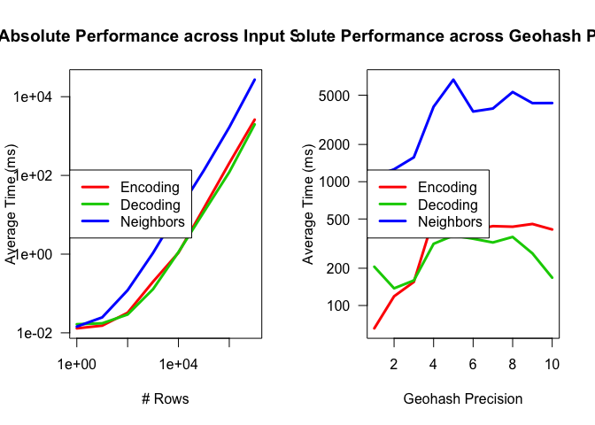
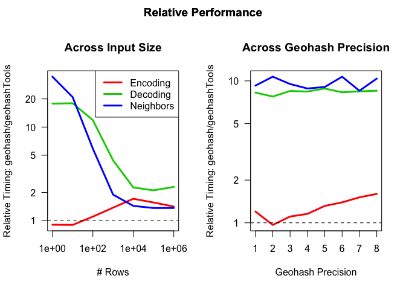

# Comparing efficiency with `geohash` package

I mentioned in the [`README`](README.md) that `gh_encode` is fast; how
does it compare to the [`geohash`](https://github.com/Ironholds/geohash)
package (unfortunately, this package was removed from CRAN, which is a
big part of the motivation for making this package in the first place)?

Here is a small set of timing exercises (note – this may take several
minutes to reproduce on your machine)

## Tools and setup

``` r
library(microbenchmark)
library(data.table)

nn = 10^(0:6)
kk = 1:8
timings = CJ(n_rows = nn, precision = kk)
setkey(timings)
```

## Encoding geohashes

``` r
set.seed(49843)
# generate random points on the Earth's surface
xx = runif(max(nn), -180, 180)
yy = runif(max(nn), -90, 90)

for (n in nn) {
  x = xx[1:n]
  y = yy[1:n]
  times = if (n > 1e5) 10L else 100L
  for (k in kk) {
    # don't need as many repetitions at higher n
    p = summary(microbenchmark(times = times,
                               geohash::gh_encode(y, x, k),
                               geohashTools::gh_encode(y, x, k)), 
                unit = 'ms')
    timings[.(n, k), c('encode_geohashTools', 'encode_relative') :=
              .(p[2L, 'median'], p[1L, 'median']/p[2L, 'median'])]
  }
}
```

## Decoding geohashes

``` r
set.seed(459849)
base32 = strsplit('0123456789bcdefghjkmnpqrstuvwxyz', NULL)[[1L]]

ggghhh = sapply(integer(max(nn)), function(...) 
  paste(sample(base32, max(kk), replace = TRUE), collapse = ''))
for (n in nn) {
  gghh = ggghhh[1:n]
  times = if (n > 1e5) 10L else 100L
  for (k in kk) {
    gh = substring(gghh, 1L, k)
    p = summary(microbenchmark(times = times,
                               geohash::gh_decode(gh),
                               geohashTools::gh_decode(gh)),
                unit = 'ms')
    timings[.(n, k), c('decode_geohashTools', 'decode_relative') :=
              .(p[2L, 'median'], p[1L, 'median']/p[2L, 'median'])]
  }
}
```

## Finding geohash neighbors

``` r
# re-use ggghhh from above
for (n in nn) {
  gghh = ggghhh[1:n]
  times = if (n > 1e5) 10L else 100L
  for (k in kk) {
    gh = substring(gghh, 1L, k)
    p = summary(microbenchmark(times = times,
                               geohash::gh_neighbours(gh),
                               geohashTools::gh_neighbors(gh)),
                unit = 'ms')
    timings[.(n, k), c('neighbors_geohashTools', 'neighbors_relative') :=
              .(p[2L, 'median'], p[1L, 'median']/p[2L, 'median'])]
  }
}
```

# Results

## Absolute timing

``` r
par(oma = c(0, 0, 2, 0))
timings[ , {
  by = 'n_rows'
  xlab_map = c(n_rows = '# Rows', precision = 'Geohash Precision')
  log_map = c(n_rows = 'xy', precision = 'y')
  main_map = c(n_rows = 'Across Input Size',
               precision = 'Across Geohash Precision')
  rel_cols = paste0(c('encode', 'decode', 'neighbors'), '_geohashTools')
  par(mfrow = 1:2)
  for (by in c('n_rows', 'precision')) {
    .SD[ , lapply(.SD, mean), keyby = by, .SDcols = rel_cols
         ][ , {
           y = as.matrix(.SD[ , !by, with = FALSE])
           matplot(.SD[[1L]], y, type = 'l', lty = 1L, lwd = 3L, 
                   log = log_map[by], xlab = xlab_map[by], col = 2:4,
                   las = 1L, main = main_map[by],
                   ylab = 'Average Time (ms)')
           if (by == 'n_rows')
             legend('topleft', col = 2:4, lwd = 3L,
                    legend = c('Encoding', 'Decoding', 'Neighbors'))
         }]
    title('Absolute Performance', outer = TRUE)
  }
}]
```

<!-- -->

## Comparison against `geohash`: Relative timing

``` r
par(oma = c(0, 0, 2, 0))
timings[ , {
  by = 'n_rows'
  xlab_map = c(n_rows = '# Rows', precision = 'Geohash Precision')
  log_map = c(n_rows = 'xy', precision = 'y')
  main_map = c(n_rows = 'Across Input Size',
               precision = 'Across Geohash Precision')
  rel_cols = paste0(c('encode', 'decode', 'neighbors'), '_relative')
  par(mfrow = 1:2)
  for (by in c('n_rows', 'precision')) {
    .SD[ , lapply(.SD, mean), keyby = by, .SDcols = rel_cols
         ][ , {
           y = as.matrix(.SD[ , !by, with = FALSE])
           matplot(.SD[[1L]], y, type = 'l', lty = 1L, lwd = 3L, 
                   log = log_map[by], xlab = xlab_map[by], col = 2:4,
                   las = 1L, main = main_map[by],
                   ylab = 'Relative Timing: geohash/geohashTools')
           if (by == 'n_rows') 
             legend('topright', col = 2:4, lwd = 3L,
                    legend = c('Encoding', 'Decoding', 'Neighbors'))
           abline(h = 1, lty = 2L, lwd = 1L)
         }]
    title('Relative Performance', outer = TRUE)
  }
}]
```

<!-- -->
